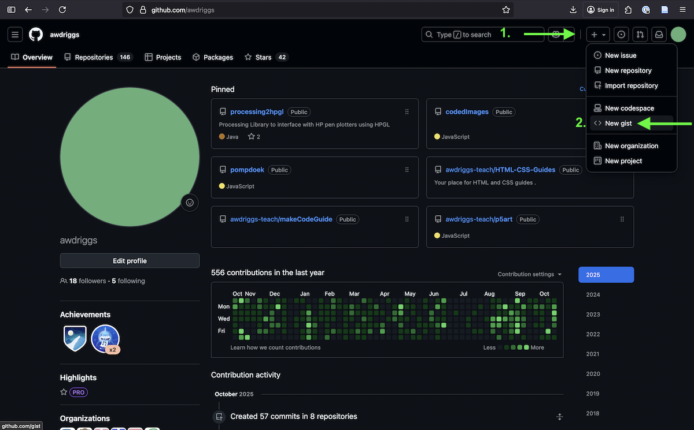
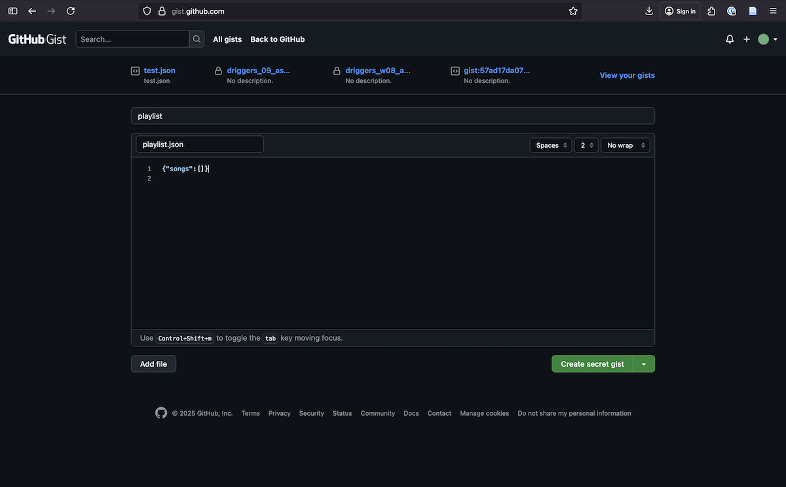
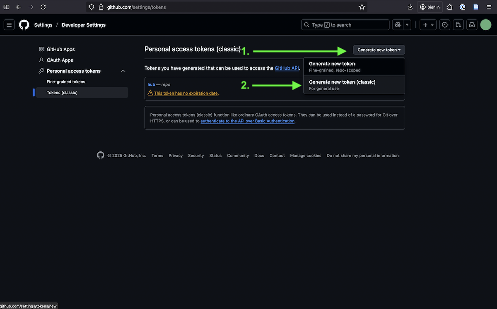
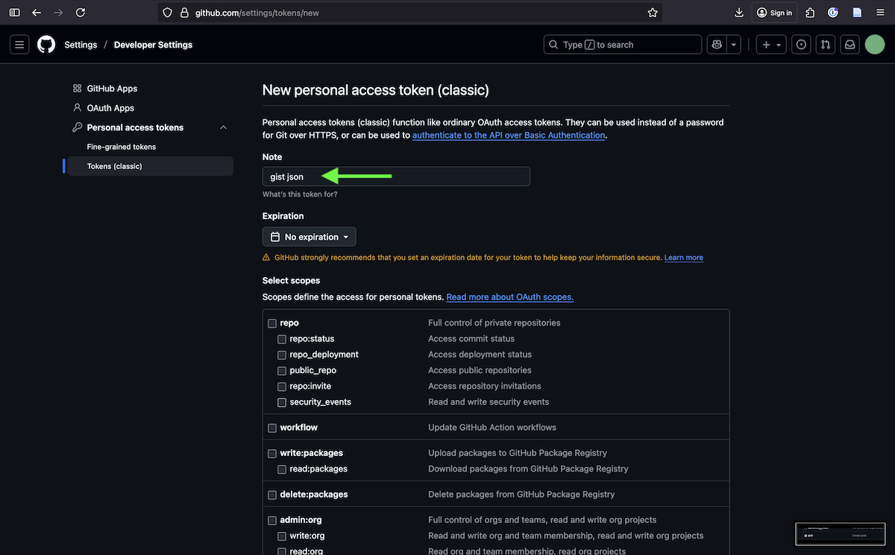
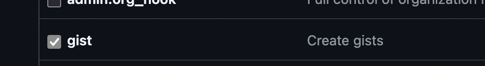

# Playlist App with GitHub Gist Storage

A simple Node.js playlist app using LowDB with GitHub Gist for data persistence. Perfect for deploying on Render.

## Setup

### 1. Create a GitHub Gist

1. Go to https://gist.github.com
2. Create a new gist (can be secret/private)
3. Name the file `playlist.json`
4. Add initial content: `{"songs":[]}`
5. Save and copy the Gist ID from the URL (the long string after your username)

#### Walkthrough



### 2. Create a GitHub Token

1. Go to https://github.com/settings/tokens
2. Click "Generate new token" → "Generate new token (classic)"
3. Give it a name like "Playlist App"
4. Check the `gist` scope
5. Generate and copy the token

#### Walkthrough




### 3. Set up Environment Variables

Create a `.env` file in the project root (copy from .env.example):

```
GIST_ID=your_gist_id_here
GIST_TOKEN=your_github_token_here
GIST_FILENAME=playlist.json
```

**Important:** Replace `your_gist_id_here` and `your_github_token_here` with your actual values!

### 4. Install and Run

```bash
npm install
npm start
```

Visit http://localhost:3000

## Deploy to Render

1. Push your code to GitHub
2. Create a new Web Service on Render
3. Connect your repository
4. Add environment variables in Render dashboard:
   - `GIST_ID`
   - `GIST_TOKEN`
   - `GIST_FILENAME`
   - `PORT` (Render sets this automatically, but you can set a default)
5. Deploy!

## API Routes

- `GET /songs` - Get all songs
- `POST /songs` - Add a song (send JSON: `{"title": "Song Name", "artist": "Artist Name"}`)
- `DELETE /songs/:id` - Delete a song by ID

## How It Works

- **LowDB**: Simple JSON database for Node.js
- **GitHub Gist**: Used as storage backend (persists data)
- **GistAdapter**: Custom adapter that syncs LowDB with your Gist using fetch API
- Each song gets a unique ID generated from timestamp
