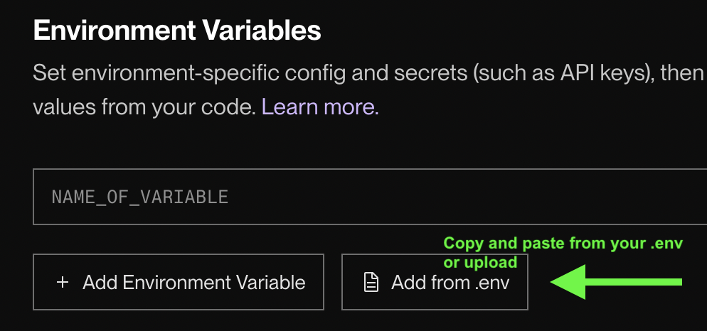

# Playlist App with GitHub Gist Storage

A simple Node.js playlist app using LowDB with GitHub Gist for data persistence. Perfect for deploying on Render.
A gist is a simple way to share text or a code snippet. In this case we will use to store a simple low db json database.
Gist can be public or secret. Even if they are secret they can be accessed with a URL with no authorization. So this should not be used for sensitive data. 

## Setup

### 1. Create a GitHub Gist

1. Go to https://gist.github.com
2. Create a new gist (can be secret/private)
3. Name the file `playlist.json`
4. Add initial content: `{"songs":[]}`
5. Save and copy the Gist ID from the URL (the long string after your username)

#### Walkthrough
Click the + symbol, select gist


Make sure to input the 


### 2. Create a GitHub Token

1. Go to https://github.com/settings/tokens
2. Click "Generate new token" → "Generate new token (classic)"
3. Give it a name like "Playlist App"
4. Check the `gist` scope
5. Generate and copy the token

#### Walkthrough
Create a new token


Name the token whatever, just for you to remember what this is for.


Scroll down and select gist. Make sure everything else is unchecked


### 3. Set up Environment Variables
Environment variables are key value pairs that provide configuration information for an application. They are a way of hold secret info on a server and not exposing to the frontend or when pushing to git hub.
Many API or services use environment variables for authorization. That is what w are doing here. We are secretly storing the github token and gist id so it won't be exposed. Now only our server will be able to read and write to this gist.

Create a `.env` file in the project root (copy from .env.example):

```
GIST_ID=your_gist_id_here
GIST_TOKEN=your_github_token_here
GIST_FILENAME=playlist.json
```

**Important:** Replace `your_gist_id_here` and `your_github_token_here` with your actual values!

### 4. Install and Run

```bash
npm install
npm start
```

Visit http://localhost:3000

## Deploy to Render

1. Push your code to GitHub
2. Create a new Web Service on Render
3. Connect your repository
4. Add environment variables in Render dashboard:
   - `GIST_ID`
   - `GIST_TOKEN`
   - `GIST_FILENAME`

5. Deploy!

## API Routes

- `GET /songs` - Get all songs
- `POST /songs` - Add a song (send JSON: `{"title": "Song Name", "artist": "Artist Name"}`)
- `DELETE /songs/:id` - Delete a song by ID

## How It Works

- **LowDB**: Simple JSON database for Node.js
- **GitHub Gist**: Used as storage backend (persists data)
- **GistAdapter**: Custom adapter that syncs LowDB with your Gist using fetch API
- Each song gets a unique ID generated from timestamp
